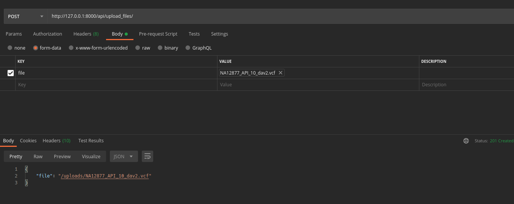

# Python Web project

This project has been created as a test answer for a position as a developer in VarSome

## API

This API rest is build with Django Rest Framework. To use it follow next steps

### start server

1. create your virtual environment and install dependencies `pip install -r requirements.txt`
2. run `python manage.py migrate`
3. run `python manage.py runserver`

### upload your file

Once our server is running you must upload a vcf file using following endpoint : `http://127.0.0.1:8000/api/upload_files/`

### End-points

* `http://127.0.0.1:8000/api/upload_files/` , to load your cvf file
  
* `http://127.0.0.1:8000/api/` , it will list all data on the file (paginated)

* `http://127.0.0.1:8000/api/rs00000` , it show a variant in detail 
  
* `http://127.0.0.1:8000/api/update-variant/rs00000` , your are allowed to update aspecific variant ()

* `http://127.0.0.1:8000/api/delete-variant/rs00000` , it deletes a specific variant

* `http://127.0.0.1:8000/api/add-new-variant/` ,  you must provide a correct json to add new variant
  
    
**For end-points which accept an HTTP authorization use the Baerer token stored in .env file**

### Run tests

to run unit test use `python manage.py test   `

